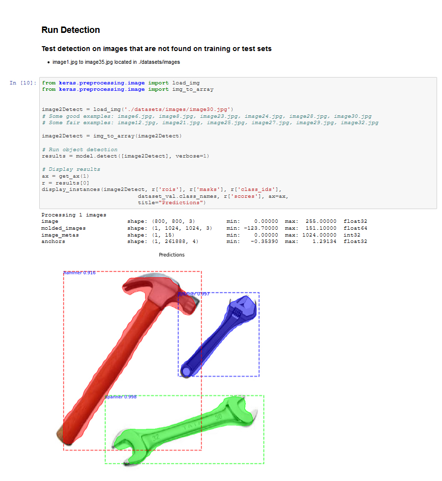
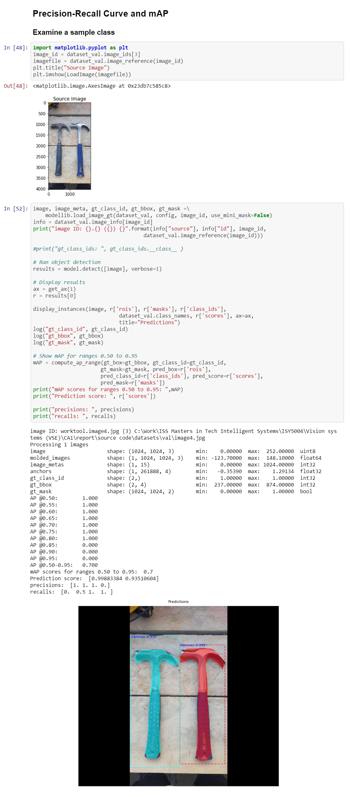

### NUS ISS CA Project Assignment 1
- Contributor: [LinkedIn](https://www.linkedin.com/in/chad-ng-60267470/)
- Adapted from github https://github.com/matterport/Mask_RCNN

## MaskRCNN

### This project is adapted and show case how to handle MaskRCNN for 2 classes
### It demonstrate the use of the following main tools:
- library imgaug, opencv
- tensorflow 1.14, keras 2.2.4
- skimage
- matplotlib, numpy, scipy
- logging, shutil, warnings, re, json

### Prepare the data images using the online tool: 
- #### Tool Name:  VGG Image Annotator 
- #### URL:        http://www.robots.ox.ac.uk/~vgg/software/via/via-1.0.6.html

### Tool use to generate augmented images from a fixed set of base images
- Tool Name:        library imgaug
- Jupyter Notebook: [image_augmentation.ipynb](https://github.com/nusisschad/MaskRCNN/blob/master/augmentation/image_augmentation.ipynb)

### The model weights required are:
- File:  	mask_rcnn_coco.h5:   
Link:	https://drive.google.com/file/d/1bjypFhACIiwSacWv_LN-DPEwrnEYMaH_/view?usp=sharing

- File: 	mask_rcnn_worktool.h5   
Link:	https://drive.google.com/file/d/1_Xqaq5vrySeGGvUAJB17ulRaRkNJiZD2/view?usp=sharing

- File: 	mask_rcnn_worktool_v2.h5   
Link:	https://drive.google.com/file/d/1me5Ig0UCFx-4t_ylPgsD0qppqwNhz4l7/view?usp=sharing   
Version 2 model is improved with some hyper-parameters adjustments and with using **imgaug library** during training 

### To check the dataset you have prepared, open the jupyter notebook:
- [inspect_worktool_data.ipynb](https://github.com/nusisschad/MaskRCNN/blob/master/inspect_worktool_data.ipynb)

### To train the Mask-RCNN model for worktool dataset, open the jupyter notebook:
- [train_worktool_model_colab_v2.ipynb](https://github.com/nusisschad/MaskRCNN/blob/master/train_worktool_model_colab_v2.ipynb)
- the notebook ***train_worktool_model_colab*** is the training script with a diiferent set of configuration parameters. Use ***train_worktool_model_colab_v2.ipynb*** for better results.

#### Train the Mask-RCNN model with Google's Colab tool:
#### Steps:
- Upload this github folder structure (contents of MaskRCNN) into your google drive, make sure the root folder is VSE/CA1
- Download the coco model weights file [mask_rcnn_coco.h5](https://drive.google.com/file/d/1bjypFhACIiwSacWv_LN-DPEwrnEYMaH_/view?usp=sharing) and upload it to VSE/CA1
- Open the jupyter notebook file "train_worktool_model_colab.ipynb" in Google Colab
- Run the scripts to create the model

### To test your trained model open the jupyter notebook:
- [inspect_worktool_model.ipynb](https://github.com/nusisschad/MaskRCNN/blob/master/inspect_worktool_model.ipynb)

